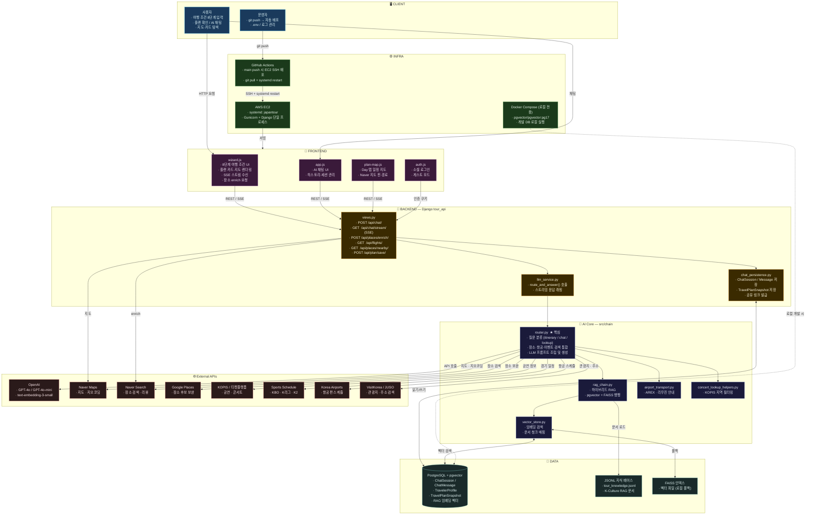

# Japan Tour Project — 시스템 구성도

> 한국 여행 플래너 웹 서비스 / 아키텍처 전체 개요

---

## 전체 구성도



---

## 계층별 역할 요약

| 계층 | 구성 요소 | 역할 |
|------|-----------|------|
| **CLIENT** | 브라우저 | 여행 조건 입력, 플랜·지도·채팅 표시 |
| **INFRA** | GitHub Actions → EC2 (systemd) | push 시 자동 배포, 서버 실행 |
| **FRONTEND** | wizard.js / plan-map.js / app.js | 8단계 UI, 지도 렌더링, SSE 채팅 |
| **BACKEND** | Django `tour_api` | REST/SSE API, 세션·스냅샷 저장 |
| **AI Core** | `src/chain/router.py` ★ | 분류·RAG·외부 API 통합·LLM 생성 |
| **External API** | OpenAI, Naver, KOPIS 등 | 생성·장소·항공·공연·스포츠 정보 |
| **DATA** | PostgreSQL + pgvector, JSONL | 이력, 프로필, 플랜, 벡터 인덱스 |

---

## 주요 데이터 흐름

### 1. 플랜 생성
```
사용자 → wizard.js → POST /api/chat/ → llm_service.py
→ router.py [분류: itinerary]
  ├── Naver Search (장소 후보 수집)
  ├── KOPIS (공연 정보)
  ├── Sports Schedule (경기 일정)
  ├── Korea Airports (항공편)
  ├── RAG (K-Culture 지식 검색)
  └── OpenAI GPT-4o (플랜 텍스트 생성)
→ JSON 응답 → wizard.js (카드·지도 렌더링)
```

### 2. 장소 카드 Enrich
```
wizard.js → POST /api/places/enrich/ → Naver Search API
→ 실제 장소명 · 주소 · 사진 · 평점 반환
→ wizard.js 카드 렌더링
```

### 3. AI 채팅 (스트리밍)
```
사용자 → app.js → GET /api/chat/stream/ (SSE)
→ router.py [분류: chat / lookup]
  ├── RAG (pgvector / FAISS 하이브리드 검색)
  └── OpenAI GPT-4o (스트리밍 생성)
→ SSE token stream → app.js 실시간 출력
```

---

## 배포 구조

```
[로컬 워크스페이스]
    git push origin main
        ↓
[GitHub Actions]
    SSH → EC2
    git pull origin main
    sudo systemctl restart japantour
        ↓
[AWS EC2]
    systemd: japantour (Gunicorn + Django)
    ← .env (API 키, DB 접속 정보)
    ← PostgreSQL (EC2 내 또는 외부 DB)
```

> 로컬 개발 시에는 `docker compose up -d` 로 PostgreSQL + pgvector 컨테이너를 실행

---

## 외부 API 목록

| API | 클라이언트 파일 | 용도 |
|-----|----------------|------|
| OpenAI | (llm_service) | 플랜 생성, 채팅, 임베딩 |
| Naver Maps | `naver_maps_client.py` | 지도, 지오코딩 |
| Naver Search | `naver_search_client.py` | 장소 검색, 리뷰 시그널 |
| Google Places | `google_places_client.py` | 장소 후보 보완 |
| KOPIS / 티켓 | `ticket_platform_events_client.py` | 공연·콘서트 (지역 필터) |
| Sports Schedule | `sports_schedule_client.py` | KBO · K리그 · K2 경기 |
| Korea Airports | `korea_airports_flight_client.py` | 항공편 스케줄 |
| VisitKorea | `visitkorea_client.py` | 관광지, 축제 정보 |
| JUSO | `juso_client.py` | 한국 주소 검색 |
| ODSay | `odsay_client.py` | 대중교통 경로 |

---

*관련 문서: [README.md](../README.md) · [요件定義書](./要件定義書.md) · [基本設計書](./基本設計書.md)*
