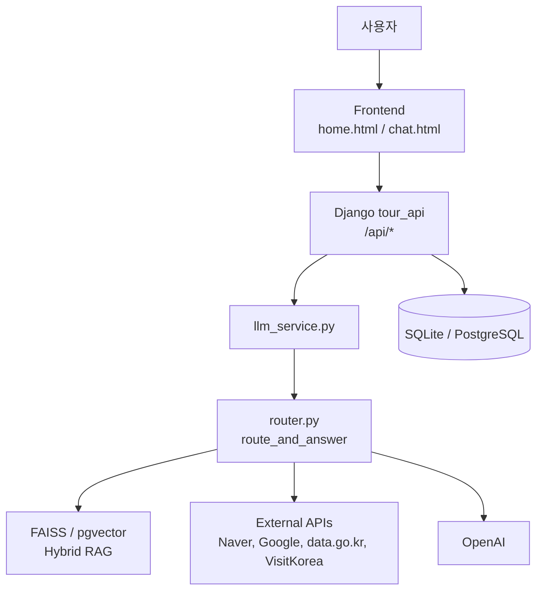
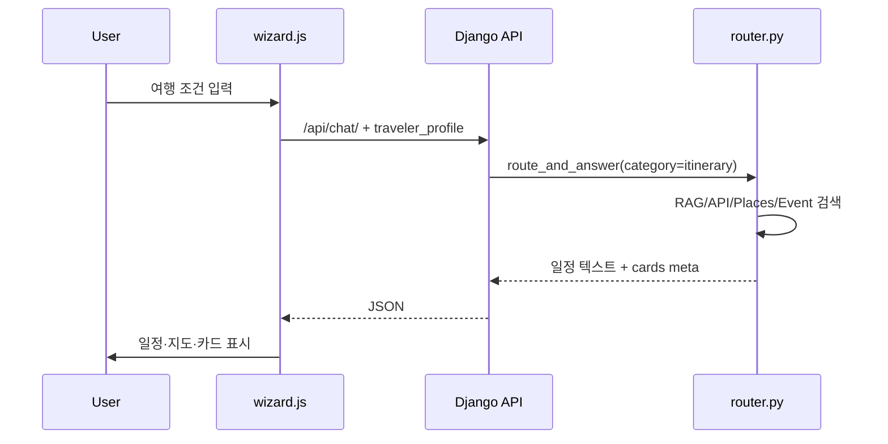
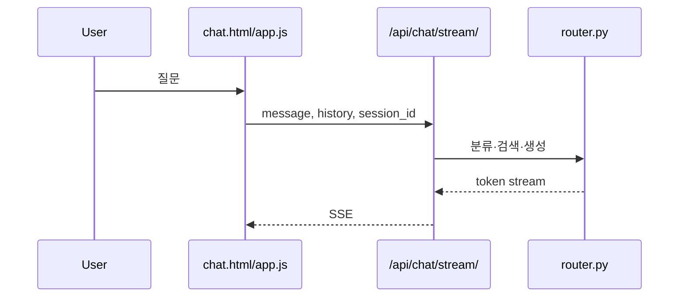

# Japan Tour Project — 시스템 설계 개요

일본어 버전: [system-design-overview_jp.md](./system-design-overview_jp.md)

## 1. 개요

Japan Tour Project는 방한 일본인 관광객을 위한 여행 플랜 생성 및 AI 채팅 서비스이다. Django가 정적 프론트엔드와 API를 같은 오리진에서 제공하고, `src/chain/router.py`가 AI 분류, RAG 검색, 외부 API 연동, LLM 응답 생성을 통합한다.

## 2. 전체 구성

## 3. 레이어 구성

| 레이어 | 구성 | 역할 |
| --- | --- | --- |
| Client | Browser | 입력, 일정 표시, 채팅 표시 |
| Frontend | `frontend/*.html/js/css` | 위저드, 지도, 카드, SSE 처리 |
| Backend | `backend/tour_api` | API, 인증, 세션, 정적 HTML 제공 |
| AI Core | `src/chain/router.py` | 분류, 검색, 컨텍스트 생성, 답변 |
| Data | DB, JSONL, vector index | 이력, 프로필, 지식 데이터 |
| External | OpenAI, Naver, data.go.kr 등 | 생성, 검색, 교통, 이벤트 정보 |

## 4. 주요 흐름

### 4.1 플랜 생성

### 4.2 AI 채팅

## 5. 외부 API

| API | 용도 |
| --- | --- |
| OpenAI | 분류, 답변 생성, 임베딩 |
| Naver Maps | 지도, 지오코딩 |
| Naver Search | 장소 후보와 리뷰 신호 |
| Naver Search | 장소 후보 보강 |
| data.go.kr | 인천공항, 공항철도, 항공, 이벤트 |
| VisitKorea | 관광지, 축제, 숙박 |
| JUSO | 도로명주소 검색 |

## 6. 데이터

| 데이터 | 저장 위치 |
| --- | --- |
| 채팅 세션 | DB `ChatSession`, `ChatMessage` |
| 여행 조건 | DB `TravelerProfile` |
| 공유 플랜 | DB `TravelPlanSnapshot` |
| RAG 문서 | `data/processed/tour_knowledge.jsonl` |
| 벡터 | FAISS 파일 또는 pgvector |

## 7. 비기능 설계

- CSRF와 rate limit으로 API를 보호한다.
- `.env`에 비밀 정보를 모으고 Git에 포함하지 않는다.
- 외부 API 실패 시 fallback 또는 공식 링크를 제공한다.
- 장소 후보는 Naver Search/Maps를 기본으로 사용한다.
- Streamlit은 레거시 UI이며, 데모 기준은 Django `:8000`으로 한다.

## 8. 관련 문서

- [README.md](../README.md)
- [요건정의서.md](./요건정의서.md)
- [기본설계서.md](./기본설계서.md)
- [상세설계서.md](./상세설계서.md)
