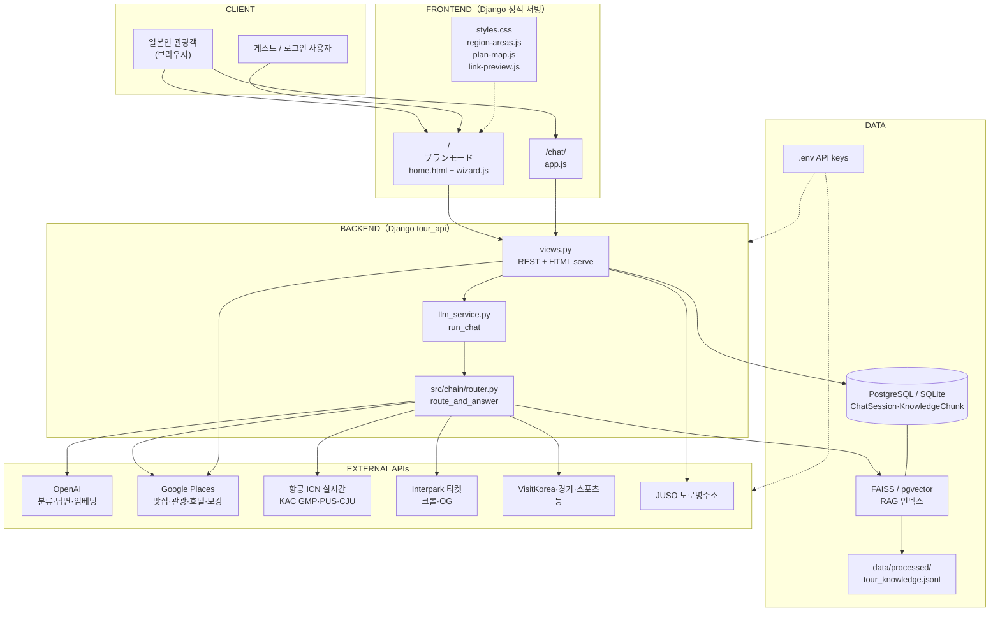
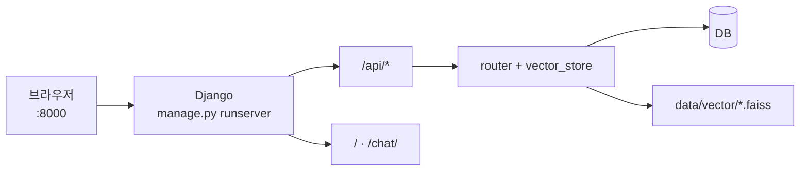
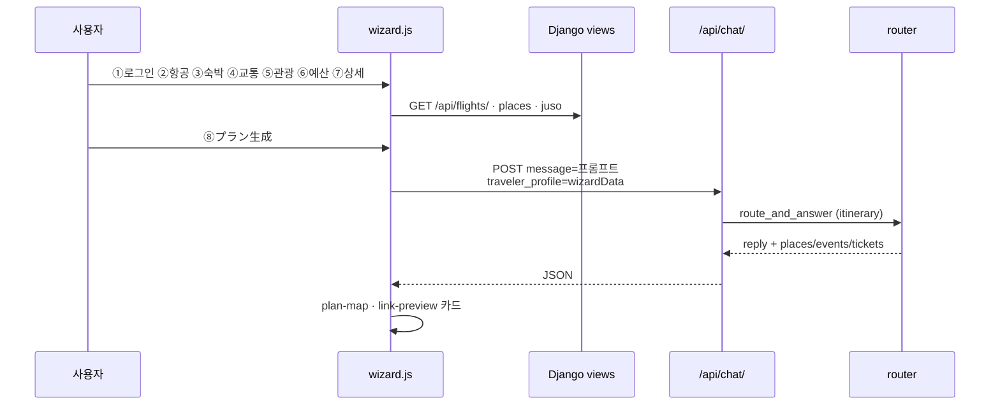
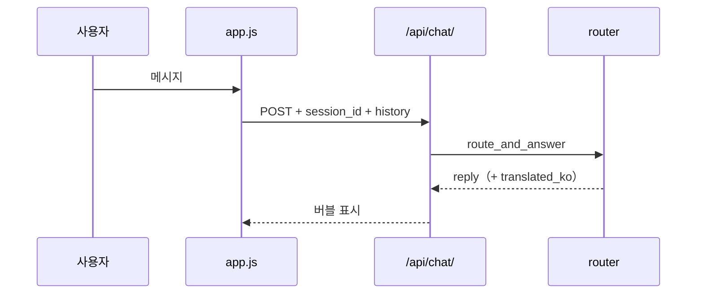
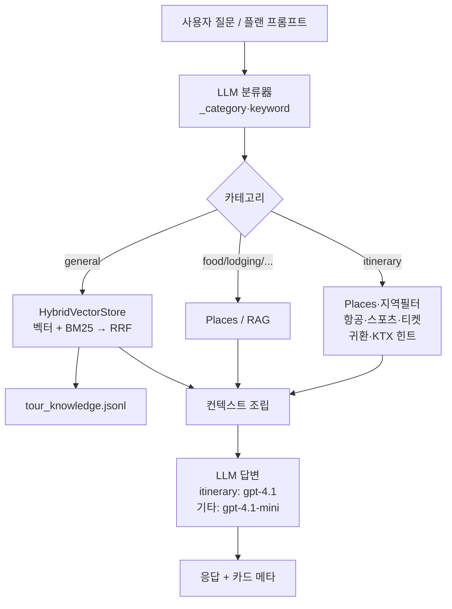
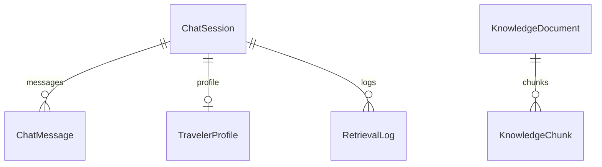

# Japan Tour Project — 시스템 설계 개요

**문서 목적**: 대표·내부 검토용으로 **구성·요청 흐름·외부 연동·데이터**를 **한 파일·짧은 시간**에 파악할 수 있게 합니다.  
**守備範囲（역할）**: API 필드·테이블 컬럼·프롬프트 전문은 **쓰지 않음**（`04-기본설계서.md` / `01-개발환경.md` / 소스 참조）.  
**갱신**: 아키텍처·엔드포인트가 바뀌면 본 문서를 함께 수정하는 것을 권장합니다.  
**다이어그램**: [Mermaid](https://mermaid.live/) 문법. GitHub·VS Code 미리보기에서 렌더링됩니다.

---

## 목차

1. [프로젝트 한 줄 요약](#1-프로젝트-한-줄-요약)
2. [시스템 구성도](#2-시스템-구성도)
3. [플랜 위저드·채팅 흐름](#3-플랜-위저드채팅-흐름)
4. [AI·RAG 파이프라인](#4-airag-파이프라인)
5. [역할·화면 요약](#5-역할화면-요약)
6. [API 그룹](#6-api-그룹대표)
7. [데이터·지식베이스](#7-데이터지식베이스)
8. [비기능·운영](#8-비기능운영-요약)
9. [관련 문서·경로](#9-관련-문서경로)

---

## 1. 프로젝트 한 줄 요약

| 항목 | 내용 |
|------|------|
| 이름 | **japantour_project** — 방한 일본인 대상 한국 여행 플래너 + AI 가이드 |
| 목적 | 8단계 위저드로 여행 조건 수집 → **일본어 일정·안내** 생성, 별도 **AI 채팅** 보조 |
| 메인 UI | **Django** `runserver :8000` + `frontend/`（`home.html` 위저드, `chat.html`） |
| 레거시 UI | **Streamlit** `app_japan_tour.py`（`:8501`, 동일 OpenAI·RAG 계열과 별 프로세스） |
| AI 코어 | `src/chain/router.py` — 분류 → RAG / Places / 항공·이벤트 API → LLM 답변 |
| 인증 | Django **세션** + 이메일 가입 / **Google·LINE OAuth**（게스트 위저드 진행 가능） |

---

## 2. 시스템 구성도

### 2.1 레이어 개요（회의용）

### 2.2 로컬 개발（단순）

**선택**: Docker `japantour-pg`（pgvector）, `VECTOR_BACKEND=faiss|pgvector`（`README.md`·`01-개발환경.md`）.

---

## 3. 플랜 위저드·채팅 흐름

### 3.1 プランモード（8단계 → 일정 생성）

| 단계 | 수집 내용 | 주요 API |
|------|-----------|----------|
| ① | 로그인·OAuth·게스트 | `/api/auth/*` |
| ② | 공항·왕복·편 선택 | `/api/flights/` |
| ③ | 숙박·주소·Places | `/api/places/search/`, JUSO |
| ④ | 교통 칩（鉄道·タクシー等） | 프로필만（LLM 컨텍스트） |
| ⑤ | 광역·시군구·활동 | `region-areas.js` |
| ⑥⑦ | 예산·동행·성향 | 프로필 |
| ⑧ | 일정 텍스트·지도·티켓 카드 | `/api/chat/`, `/api/places/enrich/` |

**참고**: `wizardData`는 **브라우저 메모리**（새로고침 시 소실）. 플랜도 채팅 API 1회 호출로 생성.

### 3.2 AIチャット

---

## 4. AI·RAG 파이프라인

| 구성 | 역할 |
|------|------|
| `HybridVectorStore` | FAISS 또는 pgvector + BM25, RRF（k=60） |
| `_is_low_value_record` | 영업시간·메뉴가격 등 저가치 Q&A 제외 |
| `build_chunk_text` | ja/ko Q&A + category/area 임베딩 |
| `google_places_client` | `locationRestriction`（KR bbox）하드 필터 |
| `api_places_enrich` | LLM 가게명 → Places, **regions** 주소 필터 |

---

## 5. 역할·화면 요약

| 대상 | 경로·기능 |
|------|-----------|
| 관광객 | `/` プランモード 8단계, `/chat/` AI 상담 |
| 로그인 | 헤더 ログアウト, 세션 유지 |
| 게스트 | ① 건너뛰기 → ②부터 |
| 운영·개발 | `.env`, `manage.py`, `evaluation/`, Docker DB |

**UI 언어**: 위저드·플랜·항공 메시지 **일본어** 중심. 채팅 **日本語 / 한국어** 선택.

---

## 6. API 그룹（대표）

| 영역 | Path | 비고 |
|------|------|------|
| 헬스 | `GET /api/health/` | OpenAI·vector backend |
| 채팅·플랜 | `POST /api/chat/` | rate limit, CSRF, `traveler_profile` |
| 인증 | `/api/auth/login|register|logout|me` | OAuth Google/LINE |
| 항공 | `GET /api/flights/?dep&arr&date` | ICN / KAC |
| Places | `GET /api/places/search/` | 호텔·맛집, KR restriction |
| 보강 | `POST /api/places/enrich/` | `regions` 필터 |
| 주소 | `GET /api/address/juso/` | 도로명 |
| 티켓 OG | `GET /api/link-preview/?url=` | Interpark only |
| 지도 | `GET /api/maps/config/`, `GET /api/photo/` | Kakao/Google |
| 페이지 | `/`, `/chat/` | `frontend_urls.py` |

---

## 7. 데이터·지식베이스

| 저장소 | 내용 |
|--------|------|
| `ChatSession` / `ChatMessage` | 채팅 이력·분류 메타 |
| `TravelerProfile` | 예산·공항·관심사（채팅 세션 연동） |
| `KnowledgeDocument` / `KnowledgeChunk` | RAG（pgvector 시） |
| `data/processed/tour_knowledge.jsonl` | AI Hub 가공 Q&A |
| `data/vector/*.faiss` | FAISS 백엔드 시 |
| `.env` | `OPENAI_API_KEY`, `GOOGLE_MAPS_API_KEY`, `INCHEONTRANSPORT_API_KEY` 등 |

**인덱스 재빌드**（청크·노이즈 필터 변경 후）:  
`python -m src.chain.vector_store --build --force`

---

## 8. 비기능·운영 요약

| 항목 | 내용 |
|------|------|
| 보안 | CSRF（`X-CSRFToken`）, `DEBUG` 기본 false, 비밀번호 검증기, `/api/chat/` rate limit |
| CORS | 동일 오리진（Django가 HTML+API 동시 서빙） |
| 세션 | DEBUG 시 cache 세션 → runserver 재시작 시 로그아웃 가능 |
| 비용 | 플랜·채팅마다 LLM 2회+（분류+생성）, Places·크롤 병행 |
| 평가 | `evaluation/` Ragas·라우터 벤치（`EVAL_LEAKAGE.md`） |
| 이중 UI | Streamlit vs Django — 문서·데모 시 **:8000 기준** 권장 |

---

## 9. 관련 문서·경로

| 경로 | 설명 |
|------|------|
| `docs/01-개발환경.md` | 실행·env·ICN/KAC·DB |
| `docs/02-프로젝트-개요.md` | 목적·범위 |
| `docs/03-요구사항-정의서.md` | 요건（일부 Streamlit 기술 — 현행은 Django 보완） |
| `docs/04-기본설계서.md` | 화면·API 개요 |
| `README.md` | clone·migrate·runserver |
| `DATA_SETUP.md` / `DATA_PREPROCESSING.md` | 데이터 파이프라인 |
| `evaluation/docs/` | RAG·라우터 평가 |
| `src/chain/router.py` | 일정·지역·RAG 핵심 로직 |
| `frontend/wizard.js` | 8단계·플랜 생성 |

---

*본 문서는 리포지토리 현재 구조（Django + `frontend/` + `src/`）를 기준으로 작성되었습니다.*
