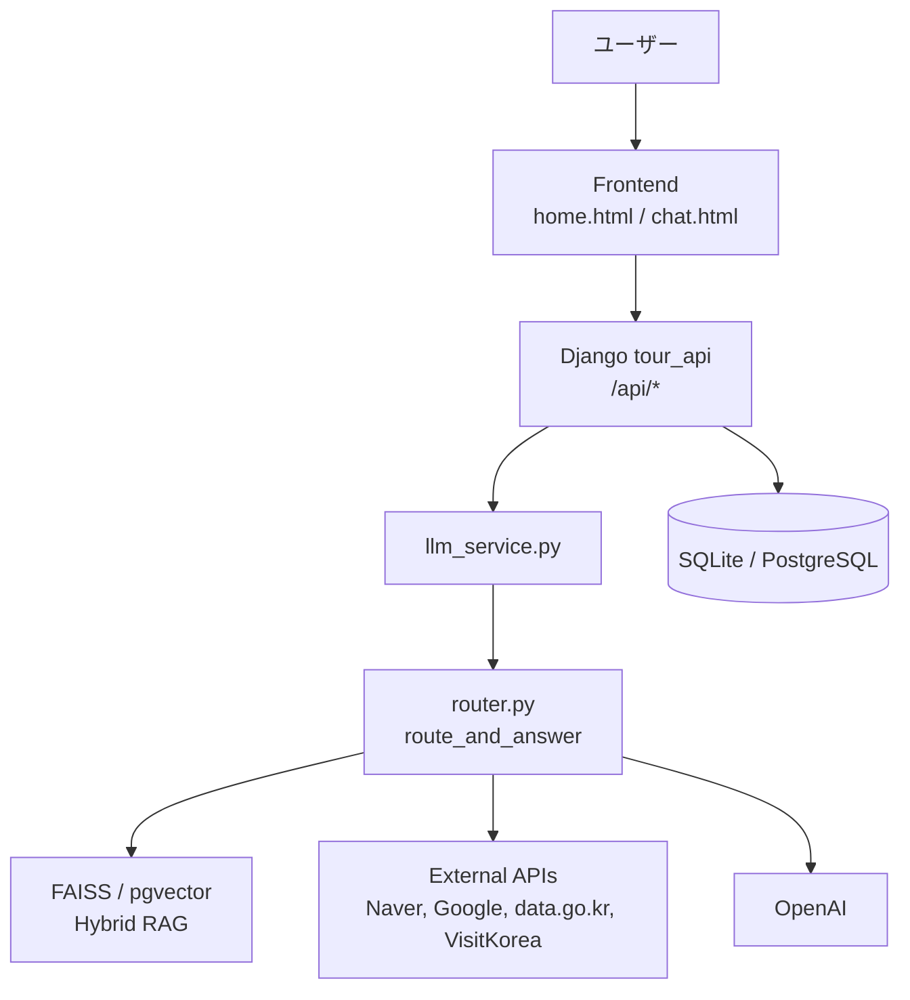
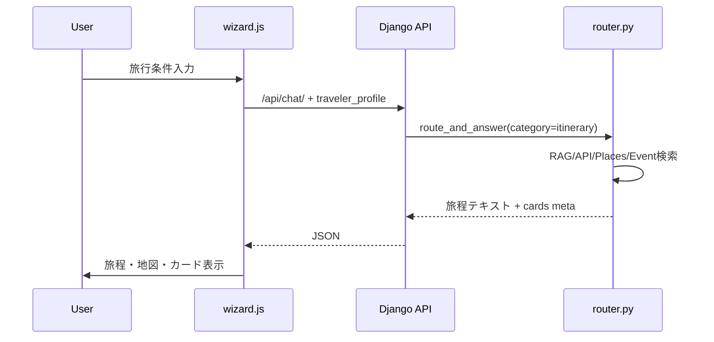
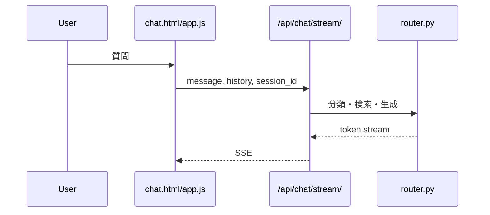

# Japan Tour Project — システム設計概要

韓国語版: [system-design-overview.md](./system-design-overview.md)

## 1. 概要

Japan Tour Projectは、訪韓日本人観光客向けの旅行プラン生成・AIチャットサービスである。Djangoが静的フロントエンドとAPIを同一オリジンで提供し、`src/chain/router.py` がAI分類、RAG検索、外部API連携、LLM回答生成を統合する。

## 2. 全体構成

## 3. レイヤー

| レイヤー | 構成 | 役割 |
| --- | --- | --- |
| Client | Browser | 入力、旅程表示、チャット表示 |
| Frontend | `frontend/*.html/js/css` | ウィザード、地図、カード、SSE処理 |
| Backend | `backend/tour_api` | API、認証、セッション、静的HTML提供 |
| AI Core | `src/chain/router.py` | 分類、検索、コンテキスト生成、回答 |
| Data | DB, JSONL, vector index | 履歴、プロフィール、ナレッジ |
| External | OpenAI, Naver, data.go.kr等 | 生成・検索・交通・イベント情報 |

## 4. 主要フロー

### 4.1 プラン生成

### 4.2 AIチャット

## 5. 外部API

| API | 用途 |
| --- | --- |
| OpenAI | 分類、回答生成、埋め込み |
| Naver Maps | 地図、ジオコーディング |
| Naver Search | 場所候補とレビューシグナル |
| Google Places | 場所候補補完 |
| data.go.kr | 仁川空港、空港鉄道、航空、イベント |
| VisitKorea | 観光地、祭り、宿泊 |
| JUSO | 住所検索 |

## 6. データ

| データ | 保存先 |
| --- | --- |
| チャットセッション | DB `ChatSession`, `ChatMessage` |
| 旅行条件 | DB `TravelerProfile` |
| 共有プラン | DB `TravelPlanSnapshot` |
| RAG文書 | `data/processed/tour_knowledge.jsonl` |
| ベクトル | FAISSファイルまたはpgvector |

## 7. 非機能設計

- CSRFとrate limitでAPIを保護する。
- `.env`に秘密情報を集約し、Gitには含めない。
- 外部API失敗時はfallbackまたは公式リンクを提示する。
- Google Placesはコスト管理のため明示的に有効化する。
- StreamlitはレガシーUIであり、デモ基準はDjangoとする。

## 8. 関連文書

- [README_jp.md](../README_jp.md)
- [要件定義書.md](./要件定義書.md)
- [基本設計書.md](./基本設計書.md)
- [詳細設計書.md](./詳細設計書.md)
