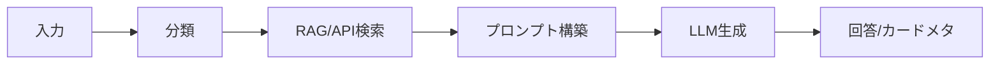

# Japan Tour Project — 基本設計書

韓国語版: [기본설계서.md](./기본설계서.md)

## 1. 目的

本書は要件定義書をもとに、システム構成、画面、API、データ、外部連携の基本設計を定義する。

## 2. システム構成

| 構成 | 説明 |
| --- | --- |
| Frontend | `frontend/home.html`, `chat.html`, `wizard.js`, `app.js`, `plan-map.js` |
| Backend | Django `backend/tour_api` |
| AI Router | `src/chain/router.py` |
| API Clients | `src/api/*_client.py` |
| DB | SQLiteまたはPostgreSQL |
| RAG | FAISSまたはpgvector |

## 3. 画面設計

| 画面 | パス | 説明 |
| --- | --- | --- |
| ホーム/プラン | `/` | 8ステップ旅行条件入力 |
| AIチャット | `/chat/` | 旅行質問への回答 |
| 共有プラン | `/share/plan/<token>/` | 保存済みプラン表示 |

## 4. ウィザード

| Step | 内容 |
| --- | --- |
| 1 | ログインまたはゲスト |
| 2 | 航空情報 |
| 3 | 宿泊情報 |
| 4 | 交通手段 |
| 5 | 地域・アクティビティ |
| 6 | 予算 |
| 7 | 同行者・旅行スタイル・食事 |
| 8 | プラン生成 |

## 5. API設計

| API | Method | 説明 |
| --- | --- | --- |
| `/api/health/` | GET | 状態確認 |
| `/api/chat/` | POST | チャット/プラン生成 |
| `/api/chat/stream/` | POST | SSEチャット |
| `/api/flights/` | GET | 航空便検索 |
| `/api/places/search/` | GET | 場所検索 |
| `/api/places/enrich/` | POST | 場所名補強 |
| `/api/address/juso/` | GET | 住所検索 |
| `/api/maps/config/` | GET | 地図設定 |
| `/api/auth/*` | GET/POST | 認証 |

## 6. データ設計

| モデル | 役割 |
| --- | --- |
| `ChatSession` | チャットセッション |
| `ChatMessage` | 会話メッセージ |
| `TravelerProfile` | 旅行条件 |
| `TravelPlanSnapshot` | 共有プラン |
| `KnowledgeDocument` | ナレッジ文書 |
| `KnowledgeChunk` | RAGチャンク |
| `RetrievalLog` | 検索ログ |

## 7. AI処理

## 8. 外部連携

| 連携 | モジュール | 説明 |
| --- | --- | --- |
| OpenAI | `llm_service.py`, `router.py` | 分類・回答 |
| Naver Maps | `naver_maps_client.py` | 地図・ジオコーディング |
| Naver Search | `naver_search_client.py` | 場所候補 |
| Google Places | `google_places_client.py` | 場所補完 |
| 仁川空港 | `aviation_client.py` | 航空・バス・タクシー・空港鉄道 |
| VisitKorea | `visitkorea_client.py` | 観光・祭り・宿泊 |

## 9. セキュリティ

- CSRFを適用する。
- チャットAPIにrate limitを適用する。
- `.env`をGitに含めない。
- 本番環境では`DJANGO_SECRET_KEY`と`DJANGO_DEBUG=false`を設定する。

## 10. エラー処理

| 状況 | 処理 |
| --- | --- |
| 外部API失敗 | fallbackまたは公式リンク |
| OpenAIキーなし | 設定案内 |
| Places結果なし | 場所名を創作しない |
| 空港鉄道API 403 | 公式時刻表fallback |
| 地図キーなし | 地図エラー表示 |
