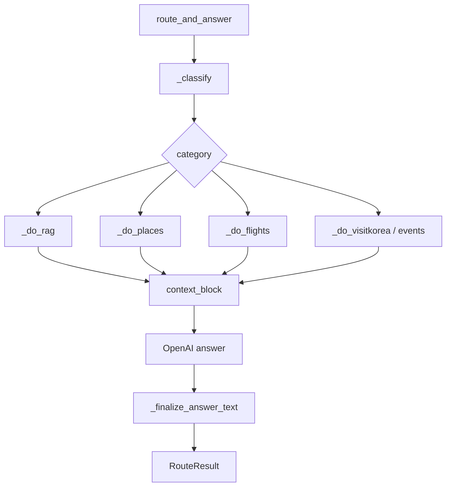

# Japan Tour Project — 詳細設計書

韓国語版: [상세설계서.md](./상세설계서.md)

## 1. 目的

本書は、実装単位のモジュール、関数、API、データモデル、例外処理、テスト方針を定義する。

## 2. モジュール詳細

| 領域 | ファイル | 詳細 |
| --- | --- | --- |
| Django API | `backend/tour_api/views.py` | REST API、HTML提供、認証、rate limit |
| LLM Service | `backend/tour_api/llm_service.py` | OpenAI client、チャット実行、翻訳補助 |
| Router | `src/chain/router.py` | 分類、RAG、外部API並列検索、回答生成 |
| Vector Search | `src/chain/vector_store.py` | FAISS/pgvector、BM25、RRF |
| Airport | `src/api/aviation_client.py` | ICN航空、バス、タクシー、空港鉄道 |
| Places | `google_places_client.py`, `naver_search_client.py` | 場所検索・検証 |
| Map UI | `frontend/plan-map.js` | Naver Map、Dayタブ、マーカー |
| Chat UI | `frontend/app.js` | SSE、リンクボタン、カード描画 |
| Wizard UI | `frontend/wizard.js` | 8ステップ入力、プラン生成 |

## 3. Router処理

## 4. 主要関数

| 関数 | 役割 |
| --- | --- |
| `_classify` | LLMでcategory/keywordを分類 |
| `route_and_answer` | 回答生成パイプライン |
| `_build_answer_system` | カテゴリ別システムプロンプト |
| `_search_rag_for_itinerary` | 旅程用RAG検索 |
| `_fmt_places` | 場所候補のコンテキスト化 |
| `_repair_wizard_itinerary_rules` | 旅程後処理 |
| `_arex_next_train_reply` | AREX次列車案内 |
| `_icn_to_seoul_transport_reply` | 仁川空港→ソウル交通案内 |

## 5. API詳細

| API | Method | 説明 |
| --- | --- | --- |
| `/api/chat/` | POST | チャット/プラン生成 |
| `/api/chat/stream/` | POST | SSEストリーミング |
| `/api/flights/` | GET | 航空便検索 |
| `/api/places/search/` | GET | 場所検索 |
| `/api/places/enrich/` | POST | 場所名補強 |
| `/api/address/juso/` | GET | 住所検索 |
| `/api/auth/*` | GET/POST | 認証 |

## 6. データモデル

| モデル | 主なフィールド |
| --- | --- |
| `ChatSession` | `id`, `user`, `created_at`, `updated_at` |
| `ChatMessage` | `session`, `role`, `content`, `metadata` |
| `TravelerProfile` | `session`, `profile_json` |
| `TravelPlanSnapshot` | `token`, `payload`, `created_at` |
| `KnowledgeChunk` | `document`, `content`, `embedding`, `metadata` |
| `RetrievalLog` | `session`, `query`, `category`, `results` |

## 7. 外部APIクライアント

| クライアント | 主なメソッド |
| --- | --- |
| `IncheonAirportClient` | `search_flights`, `search_airport_buses`, `get_taxi_status`, `search_airport_railroad` |
| `GooglePlacesClient` | 場所検索、詳細 |
| `NaverMapsClient` | ジオコーディング |
| `NaverSearchClient` | Local/Blog検索 |
| `VisitKoreaClient` | 観光地、祭り、宿泊 |
| `TicketPlatformEventsClient` | Interpark/NOLイベント |

## 8. 例外処理

| 例外 | 処理 |
| --- | --- |
| APIキーなし | 案内または機能skip |
| 公共データ403 | 利用申請状態確認、fallback |
| Places 0件 | 場所名を創作しない |
| LLM失敗 | ログ出力後エラー応答 |
| Streaming失敗 | SSE error |

## 9. テスト

| テスト | 対象 |
| --- | --- |
| `tests/test_web_search_triggers.py` | Web検索、AREX、履歴ユーティリティ |
| `tests/test_region_resolution.py` | 地域解決、候補フィルタ |
| `tests/test_plan_map_parser.js` | プラン地図パーサ |
| `python -m py_compile` | Python構文 |
| `node --check` | JavaScript構文 |

## 10. 運用

- 開発実行: `python backend\manage.py runserver 127.0.0.1:8000`
- DB: SQLiteまたはPostgreSQL/pgvector
- RAG再構築: `python -m src.chain.vector_store --build --force`
- ナレッジ投入: `python backend\manage.py import_tour_knowledge --batch-size 200`

## 11. 変更管理

- 外部API追加時は `src/api/*_client.py` に責務を分離する。
- Routerへの反映は worker と `ctx_parts` で行う。
- UIカード追加時は `frontend/app.js` または `wizard.js` に描画処理を追加する。
- 文書リンクはREADMEと各設計書で同時更新する。
