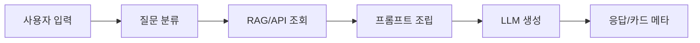

# Japan Tour Project — 기본설계서

일본어 버전: [基本設計書.md](./基本設計書.md)

## 1. 목적

본 문서는 요건정의서를 바탕으로 시스템 구성, 화면 구성, 주요 API, 데이터 구조, 외부 연동 방식을 정의한다.

## 2. 시스템 구성

| 구성 | 설명 |
| --- | --- |
| Frontend | `frontend/home.html`, `chat.html`, `wizard.js`, `app.js`, `plan-map.js` |
| Backend | Django `backend/tour_api` |
| AI Router | `src/chain/router.py` |
| API Clients | `src/api/*_client.py` |
| DB | SQLite 또는 PostgreSQL |
| RAG | FAISS 또는 pgvector |

## 3. 화면 설계

| 화면 | 경로 | 설명 |
| --- | --- | --- |
| 홈/플랜 위저드 | `/` | 8단계 여행 조건 입력 |
| AI 채팅 | `/chat/` | 여행 질문 응답 |
| 공유 플랜 | `/share/plan/<token>/` | 저장된 플랜 열람 |

## 4. 위저드 단계

| 단계 | 내용 |
| --- | --- |
| 1 | 로그인 또는 게스트 진행 |
| 2 | 항공 출발지, 도착지, 왕복, 항공편 |
| 3 | 숙박 유형, 주소, 호텔 후보 |
| 4 | 교통 선호: 철도, 버스, 택시, 렌터카 |
| 5 | 방문 지역, 시군구, 관심 활동 |
| 6 | 예산 |
| 7 | 동행, 여행 성향, 식사 선호 |
| 8 | 플랜 생성 |

## 5. API 설계

| API | Method | 설명 |
| --- | --- | --- |
| `/api/health/` | GET | 서버 상태 |
| `/api/chat/` | POST | 채팅/플랜 생성 |
| `/api/chat/stream/` | POST | 스트리밍 채팅 |
| `/api/flights/` | GET | 항공편 조회 |
| `/api/places/search/` | GET | 장소 검색 |
| `/api/places/enrich/` | POST | 장소명 보강 |
| `/api/address/juso/` | GET | 주소 검색 |
| `/api/maps/config/` | GET | 지도 설정 |
| `/api/auth/*` | GET/POST | 인증 |

## 6. 데이터 설계

| 모델 | 역할 |
| --- | --- |
| `ChatSession` | 채팅 세션 |
| `ChatMessage` | 사용자/AI 메시지 |
| `TravelerProfile` | 여행 조건 |
| `TravelPlanSnapshot` | 공유 플랜 |
| `KnowledgeDocument` | 지식 문서 |
| `KnowledgeChunk` | RAG 청크 |
| `RetrievalLog` | 검색 로그 |

## 7. AI 처리 설계

| 단계 | 설명 |
| --- | --- |
| 분류 | 여행 질문을 transport, itinerary, food 등으로 분류 |
| 검색 | RAG, Places, 항공, 교통, 이벤트 조회 |
| 조립 | 검증 데이터와 규칙을 시스템 프롬프트에 반영 |
| 생성 | 일본어 또는 한국어 응답 생성 |
| 후처리 | 일정 규칙, URL, 카드 메타 보정 |

## 8. 외부 연동 설계

| 연동 | 모듈 | 설명 |
| --- | --- | --- |
| OpenAI | `llm_service.py`, `router.py` | 분류·응답 |
| Naver Maps | `naver_maps_client.py` | 지도·지오코딩 |
| Naver Search | `naver_search_client.py` | 장소 후보 |
| Google Places | `google_places_client.py` | 장소 보강 |
| 인천공항 | `aviation_client.py` | 항공·버스·택시·공항철도 |
| VisitKorea | `visitkorea_client.py` | 관광·축제·숙박 |

## 9. 보안 설계

- Django CSRF 보호를 적용한다.
- 채팅 API에 rate limit을 적용한다.
- `.env`는 Git에 포함하지 않는다.
- 운영 환경에서는 `DJANGO_SECRET_KEY`, `DJANGO_DEBUG=false`를 설정한다.
- OAuth redirect URI는 허용 도메인으로 제한한다.

## 10. 오류 처리

| 상황 | 처리 |
| --- | --- |
| 외부 API 실패 | fallback 데이터 또는 공식 링크 안내 |
| OpenAI 키 없음 | 설정 필요 안내 |
| Places 결과 없음 | 장소명 창작 금지, 일반 안내 |
| 공항철도 API 403 | 공식 시간표 fallback |
| 지도 키 없음 | 지도 오류 메시지와 콘솔 확인 안내 |
