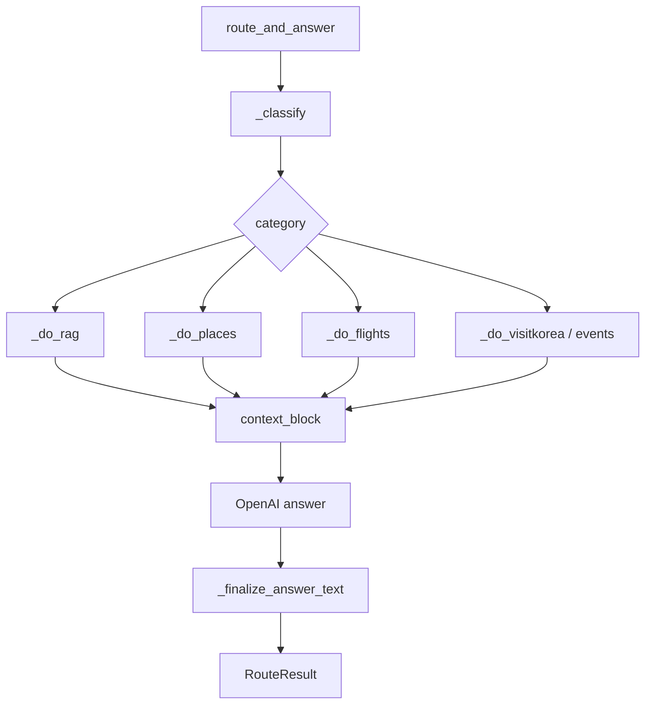

# Japan Tour Project — 상세설계서

일본어 버전: [詳細設計書.md](./詳細設計書.md)

## 1. 목적

본 문서는 구현 단위의 모듈, 함수, API 요청/응답, 데이터 모델, 예외 처리, 테스트 기준을 정의한다.

## 2. 모듈 상세

| 영역 | 파일 | 상세 |
| --- | --- | --- |
| Django API | `backend/tour_api/views.py` | REST API, HTML serve, 인증, rate limit |
| LLM 서비스 | `backend/tour_api/llm_service.py` | OpenAI client, 채팅 실행, 번역 보조 |
| 라우터 | `src/chain/router.py` | 분류, RAG, 외부 API 병렬 조회, 답변 생성 |
| 벡터 검색 | `src/chain/vector_store.py` | FAISS/pgvector, BM25, RRF |
| 항공/공항 | `src/api/aviation_client.py` | ICN 항공, 버스, 택시, 공항철도 |
| 장소 | `src/api/google_places_client.py`, `naver_search_client.py` | 장소 검색·검증 |
| 지도 | `frontend/plan-map.js` | Naver Map, Day 탭, 마커, 카드 |
| 채팅 UI | `frontend/app.js` | SSE, 링크 버튼, 카드 렌더링 |
| 위저드 UI | `frontend/wizard.js` | 8단계 입력, 플랜 요청 |

## 3. 라우터 처리 상세

## 4. 주요 함수

| 함수 | 역할 |
| --- | --- |
| `_classify` | LLM으로 질문 category/keyword 분류 |
| `route_and_answer` | 전체 답변 생성 파이프라인 |
| `_build_answer_system` | 카테고리별 시스템 프롬프트 구성 |
| `_search_rag_for_itinerary` | 일정용 RAG 검색 |
| `_fmt_places` | 장소 후보를 LLM 컨텍스트로 변환 |
| `_repair_wizard_itinerary_rules` | 일정 후처리 |
| `_arex_next_train_reply` | AREX 다음 열차 안내 |
| `_icn_to_seoul_transport_reply` | 인천공항→서울 교통 안내 |

## 5. API 상세

### 5.1 `/api/chat/`

| 항목 | 내용 |
| --- | --- |
| Method | POST |
| 입력 | `message`, `reply_language`, `history`, `session_id`, `traveler_profile` |
| 출력 | `reply`, `translated_ko`, `category`, `keyword`, 카드 메타 |
| 처리 | `run_chat` → `route_and_answer` |

### 5.2 `/api/chat/stream/`

| 항목 | 내용 |
| --- | --- |
| Method | POST |
| 출력 | SSE `meta`, `token`, `done`, `error` |
| 특징 | 스트리밍 중 텍스트 표시, 완료 후 링크·카드 hydration |

### 5.3 `/api/flights/`

| 항목 | 내용 |
| --- | --- |
| Method | GET |
| Query | `dep`, `arr`, `date` |
| 데이터 | ICN은 인천공항 API, GMP/PUS/CJU는 KAC/odcloud |

### 5.4 `/api/places/search/`

| 항목 | 내용 |
| --- | --- |
| Method | GET |
| Query | `q`, `lat`, `lng`, `radius`, `type` |
| 처리 | Naver/Google Places 후보 반환 |

## 6. 데이터 모델 상세

| 모델 | 주요 필드 |
| --- | --- |
| `ChatSession` | `id`, `user`, `created_at`, `updated_at` |
| `ChatMessage` | `session`, `role`, `content`, `translated_ko`, `metadata` |
| `TravelerProfile` | `session`, `profile_json` |
| `TravelPlanSnapshot` | `token`, `payload`, `created_at` |
| `KnowledgeChunk` | `document`, `content`, `embedding`, `metadata` |
| `RetrievalLog` | `session`, `query`, `category`, `results` |

## 7. 외부 API 클라이언트 상세

| 클라이언트 | 주요 메서드 |
| --- | --- |
| `IncheonAirportClient` | `search_flights`, `search_airport_buses`, `get_taxi_status`, `search_airport_railroad` |
| `GooglePlacesClient` | 장소 검색, 상세 조회 |
| `NaverMapsClient` | 지오코딩 |
| `NaverSearchClient` | 로컬/블로그 검색 |
| `VisitKoreaClient` | 관광지, 축제, 숙박 검색 |
| `TicketPlatformEventsClient` | Interpark/NOL 이벤트 검색 |

## 8. 예외 처리

| 예외 | 처리 |
| --- | --- |
| API 키 없음 | 사용자 안내 또는 해당 기능 skip |
| 공공데이터 403 | 활용신청 상태 확인, fallback |
| Places 0건 | 장소 창작 금지 |
| LLM 실패 | 로깅 후 오류 응답 |
| 스트리밍 실패 | SSE error 이벤트 |

## 9. 테스트 설계

| 테스트 | 대상 |
| --- | --- |
| `tests/test_web_search_triggers.py` | 웹 검색/AREX/히스토리 유틸 |
| `tests/test_region_resolution.py` | 지역 해석, 후보 필터 |
| `tests/test_plan_map_parser.js` | 플랜 지도 파서 |
| `python -m py_compile` | Python 문법 |
| `node --check` | JavaScript 문법 |

## 10. 배포·운영 상세

- 개발: `python backend\manage.py runserver 127.0.0.1:8000`
- DB: SQLite 또는 Docker PostgreSQL/pgvector
- RAG 재빌드: `python -m src.chain.vector_store --build --force`
- 지식 적재: `python backend\manage.py import_tour_knowledge --batch-size 200`
- 로그: Django console logger, `src`, `tour_api` logger

## 11. 변경 관리

- 외부 API 추가 시 `src/api/*_client.py`에 클라이언트 추가
- 라우터 컨텍스트는 `route_and_answer` 내 병렬 worker와 `ctx_parts`에 반영
- UI 카드가 필요한 경우 `frontend/app.js` 또는 `wizard.js`에서 렌더러 추가
- 문서 변경 시 README와 설계서 링크를 함께 갱신
